# Engineering Toolkit — Plant 3D → AVEVA E3D

Ferramenta experimental de interoperabilidade para apoiar a transferência, validação e reconstrução de dados de tubulação entre fluxos originados no **AutoCAD Plant 3D** e o **AVEVA E3D**.

> **Status:** projeto acadêmico/técnico em evolução. Este repositório público é uma apresentação controlada do projeto e não contém catálogos comerciais, bibliotecas proprietárias, dados de clientes nem o código-fonte corporativo completo.

## Contexto

O Engineering Toolkit nasceu de uma necessidade prática de migração tecnológica em projetos de tubulação industrial. A mudança de ambiente de projeto exige mais do que converter um arquivo: os dois ecossistemas representam topologia, geometria, catálogo e identidade de componentes de maneiras diferentes.

O trabalho passou a tratar esse problema em três níveis:

1. **interpretação da origem**, a partir de arquivos PCF;
2. **normalização e validação**, usando uma representação intermediária em JSON;
3. **materialização no E3D**, com pré-validação, resolução de catálogo e execução controlada.

## Problema tratado

Uma importação pode preservar coordenadas e ainda produzir uma linha tecnicamente incorreta. Durante o desenvolvimento foram encontrados casos como:

- origem de *branches* interpretada de forma incorreta;
- visualização parcial de trechos;
- componentes com geometria semelhante, mas dimensões incompatíveis entre origem e destino;
- divergências de classe, schedule, conexão e material;
- ausência de equivalente direto no catálogo do E3D;
- risco de criação parcial quando apenas parte da linha pode ser resolvida.

Esses casos levaram o projeto a adotar uma política conservadora: **não considerar uma importação como válida apenas porque algo foi desenhado**.

## Arquitetura

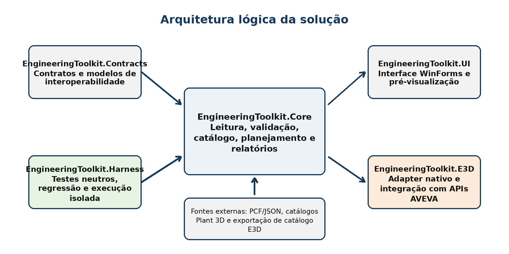

O projeto foi estruturado em módulos de contratos, núcleo de processamento, interface, integração E3D e *harness* de testes.

## Fluxo de interoperabilidade

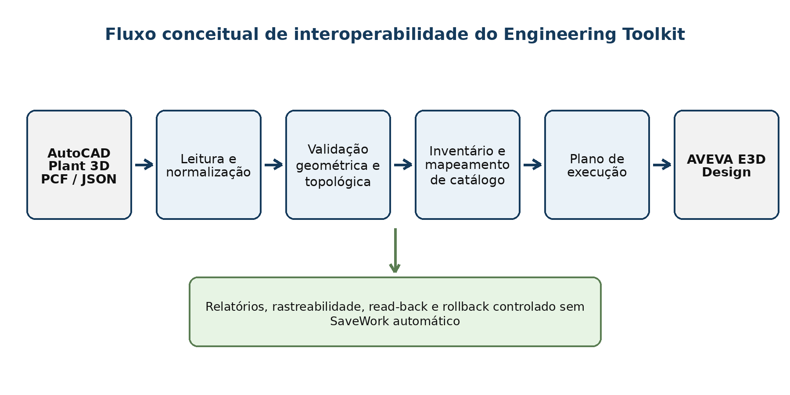

O PCF é interpretado e convertido para um contrato intermediário. A partir dele são executadas validações de topologia, geometria e catálogo antes da tentativa de criação no ambiente de destino.

## Execução controlada

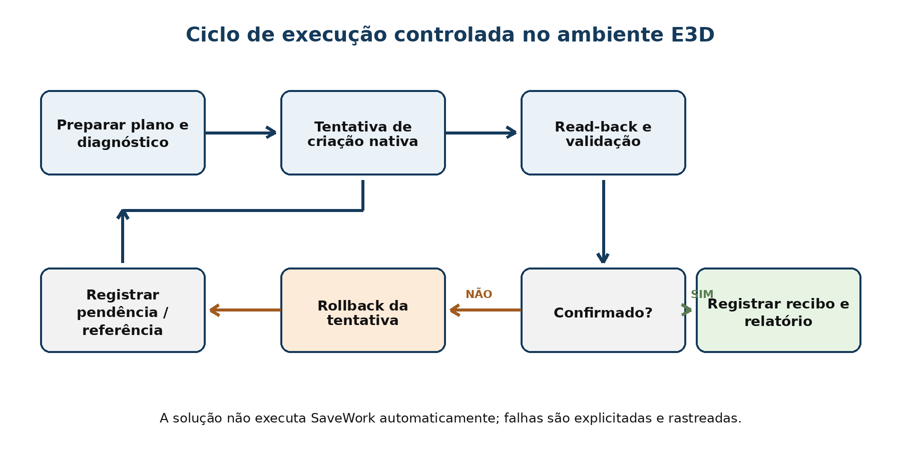

O fluxo de execução considera pré-validação, tentativa de criação, leitura de retorno (*read-back*) e reversão (*rollback*) em caso de falha. O sistema não executa `SaveWork` automaticamente.

## Demonstração visual

Abaixo estão algumas capturas reais da interface utilizada durante os testes do projeto.

### 1) Integração do comando no E3D

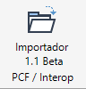
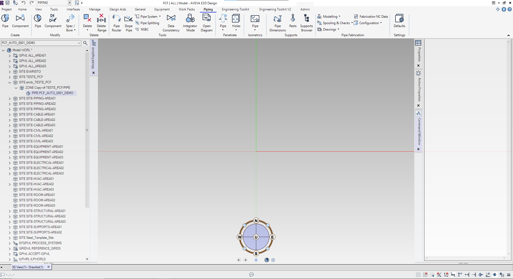

O importador é disponibilizado diretamente no ambiente do AVEVA E3D, permitindo selecionar o contexto de destino e acompanhar o resultado no próprio model explorer.

### 2) Estado inicial da ferramenta

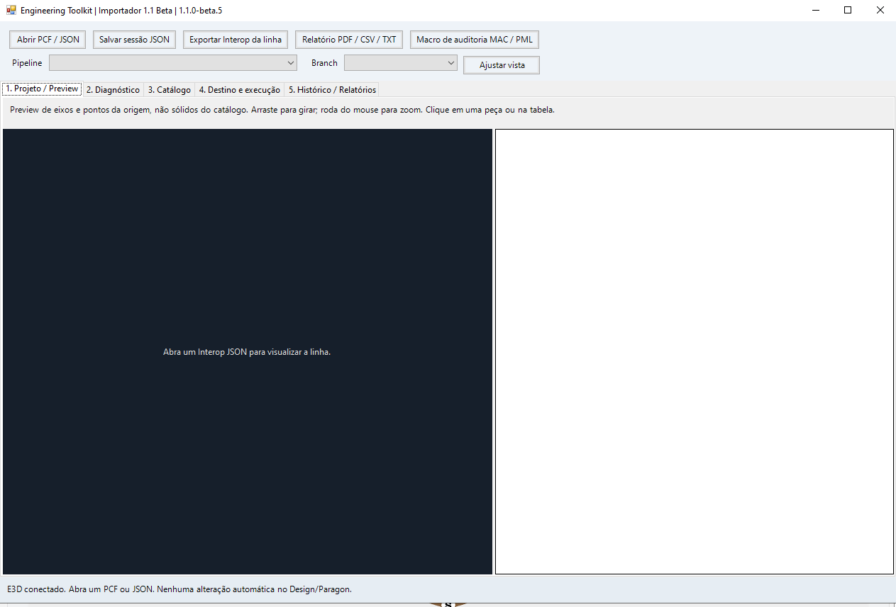

Nesta etapa, a ferramenta já está conectada ao E3D, mas ainda aguarda a abertura de um PCF ou de um JSON de interoperabilidade.

### 3) Preview do pipeline e lista de componentes

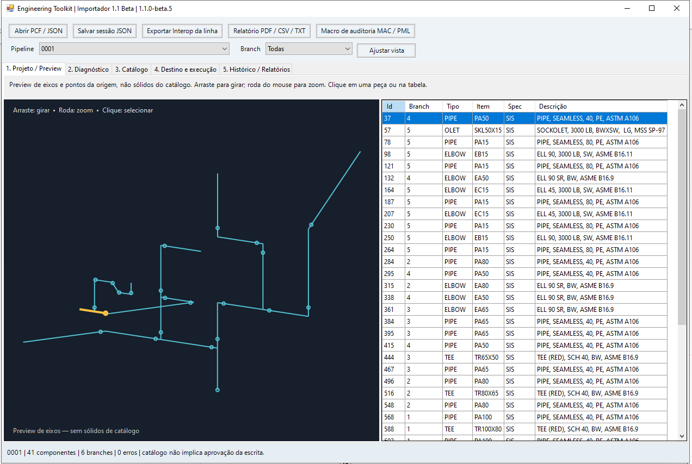

O painel de preview apresenta eixos, pontos de origem e a listagem dos componentes interpretados. Essa visão é importante para inspecionar a estrutura lógica antes da tentativa de escrita no modelo.

### 4) Análise de catálogo e divergências

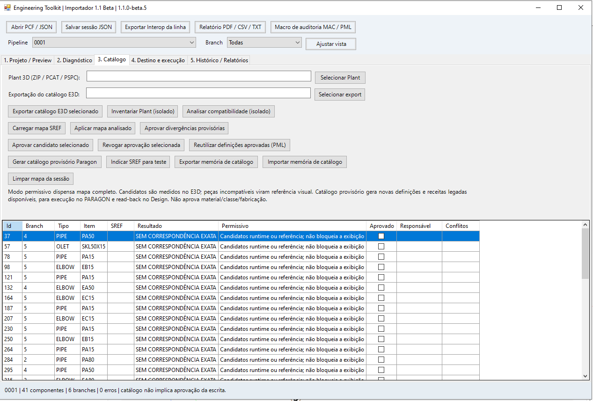

A aba de catálogo centraliza a análise de correspondência entre os itens da origem e as alternativas disponíveis no ambiente de destino. Quando não há correspondência exata, a ferramenta sinaliza a condição e evita tratar a importação como plenamente aprovada.

### 5) Definição de destino e preparação da execução

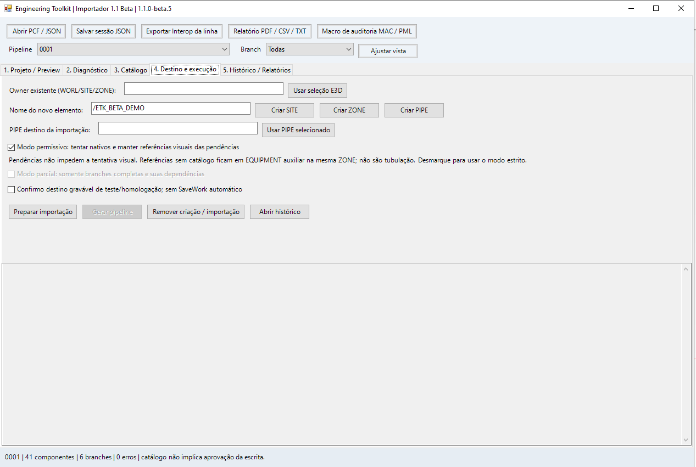

Nessa fase, o usuário escolhe o owner de destino, define o nome do novo elemento e decide se a execução será em modo permissivo ou estrito.

### 6) Confirmação antes da escrita

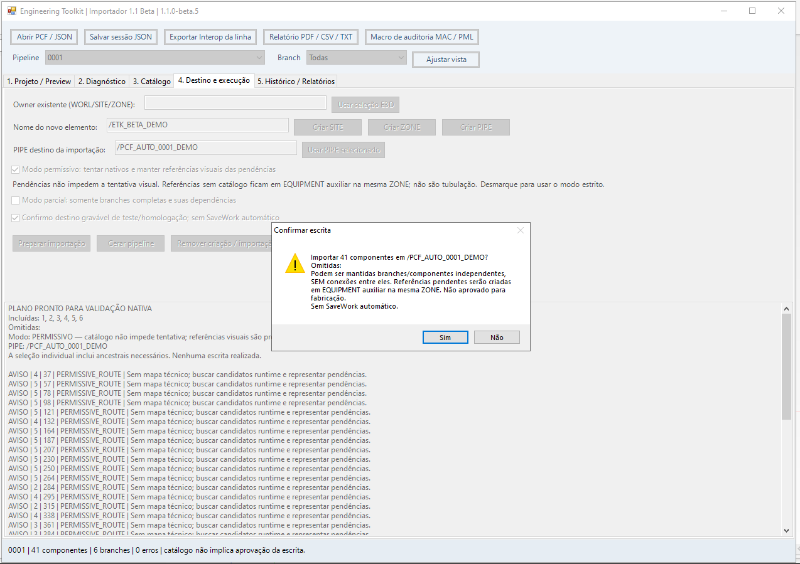

A ferramenta exige confirmação explícita antes da escrita e deixa claro quando o fluxo está operando em modo permissivo, sem SaveWork automático e com criação de referências visuais para pendências.

### 7) Diagnósticos e histórico

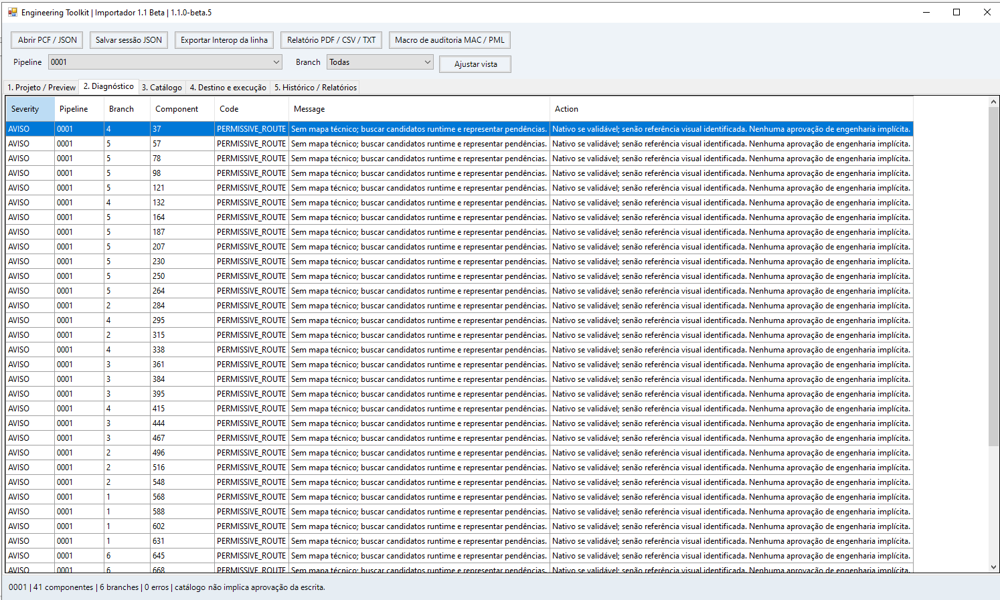
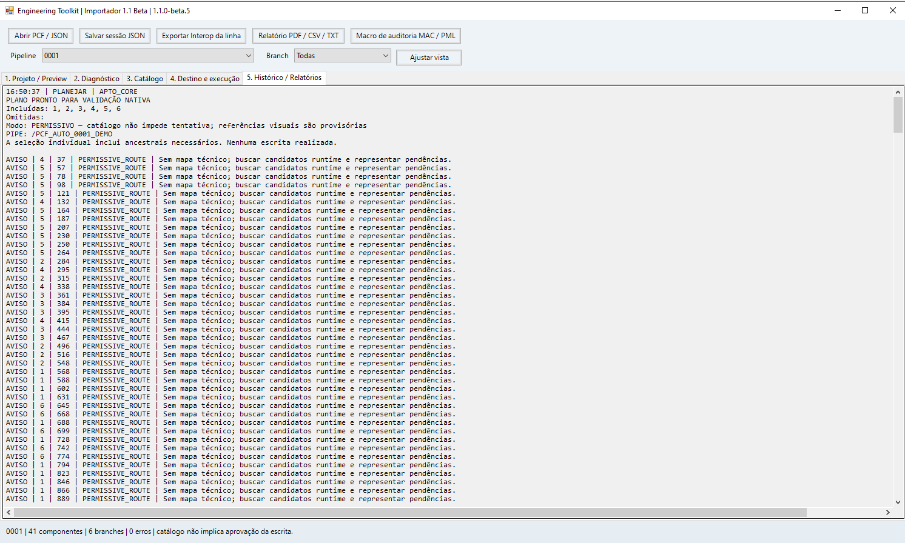

Os diagnósticos registram avisos, componentes afetados e ação recomendada, fornecendo rastreabilidade para auditoria técnica.

### 8) Resultado no modelo E3D

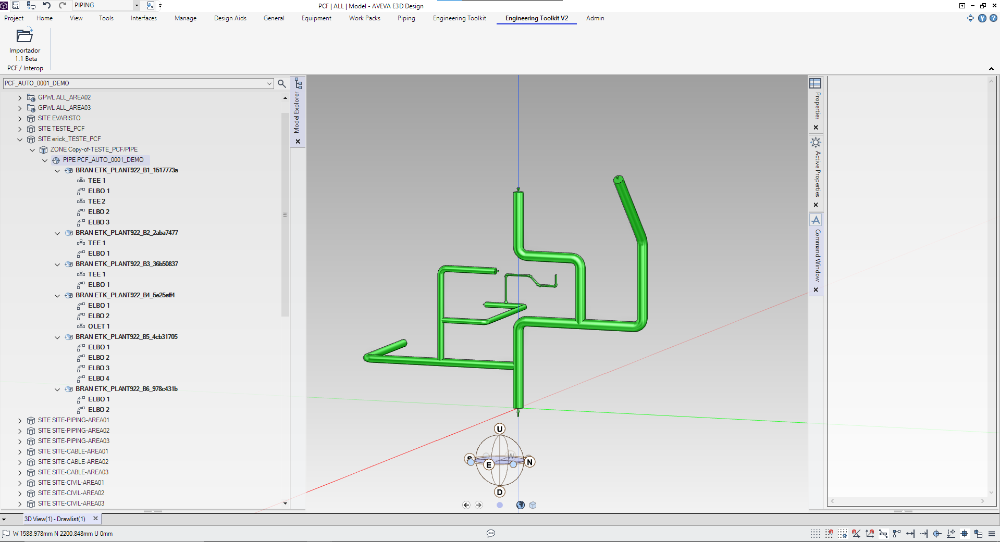
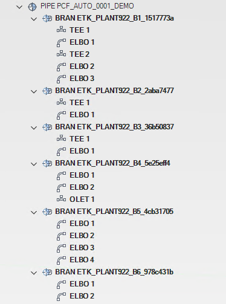

O resultado final pode ser inspecionado tanto no modelo 3D quanto na árvore do explorer. Durante os testes, essa etapa também ajudou a evidenciar casos de visualização parcial e divergências entre componentes de origem e peças efetivamente disponíveis no destino.

## Exemplo público

A pasta [`examples`](examples/) contém um caso de teste utilizado durante o desenvolvimento:

- `0001.pcf` — entrada PCF;
- `0001_interop.json` — representação intermediária correspondente.

Os exemplos publicados aqui não devem ser interpretados como catálogo comercial nem como garantia de compatibilidade universal.

## Estado técnico

A linha de desenvolvimento mais recente do pacote analisado identifica-se como **1.1.0-beta.5**. Nessa revisão, o pacote registra validação estática e inclui testes automatizados, mas o próprio estado técnico da entrega diferencia explicitamente validação estática de validação nativa em runtime E3D.

Por esse motivo, este repositório não apresenta como concluído aquilo que não foi comprovado na revisão correspondente.

## Escopo do repositório público

Este repositório tem finalidade de **portfólio técnico e documentação acadêmica**. Por segurança e propriedade intelectual, ficam de fora:

- DLLs e SDKs proprietários da AVEVA;
- catálogos Plant 3D / E3D;
- arquivos de projetos de clientes;
- mapas SREF e evidências vinculadas a projetos reais;
- binários de produção;
- código-fonte cuja publicação dependa de autorização corporativa.

Consulte [`docs/PUBLICATION_SCOPE.md`](docs/PUBLICATION_SCOPE.md).

## TCC

O Engineering Toolkit é o objeto de estudo de um Trabalho de Conclusão de Curso em Engenharia de Software. O recorte acadêmico está centrado em **interoperabilidade, arquitetura de software, validação de dados técnicos, testes e tratamento de divergências entre sistemas de engenharia**.

Veja [`docs/TCC_CONTEXT.md`](docs/TCC_CONTEXT.md).

## Tecnologias

- C#
- .NET Framework 4.7.2
- JSON
- PCF / ISOGEN
- Windows Forms
- APIs do AVEVA E3D
- PowerShell
- testes por *harness* próprio

## Dependências externas

O módulo de integração depende de bibliotecas instaladas com o AVEVA E3D. **Nenhuma DLL proprietária é distribuída neste repositório.**

AutoCAD, Plant 3D, AVEVA e E3D são marcas de seus respectivos proprietários. Este projeto não é afiliado nem oficialmente mantido por Autodesk ou AVEVA.

## Próximos passos

- ampliar a documentação de testes;
- consolidar métricas de cobertura por família de componente;
- documentar critérios de resolução de catálogo;
- evoluir o repositório após as próximas entregas do TCC.

## Autor

**Erick Cortez dos Santos Santana**  
Engenharia de Software — Universidade Santo Amaro (UNISA)
